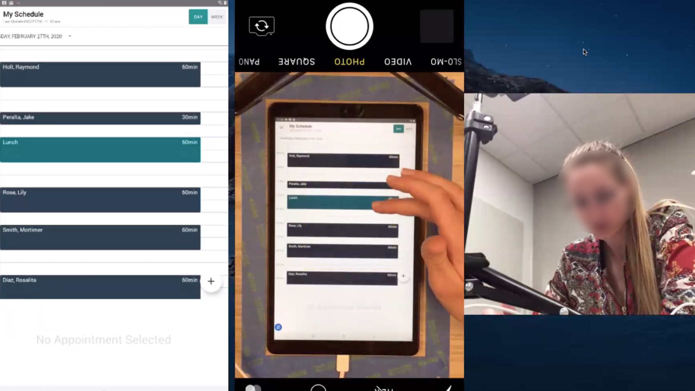
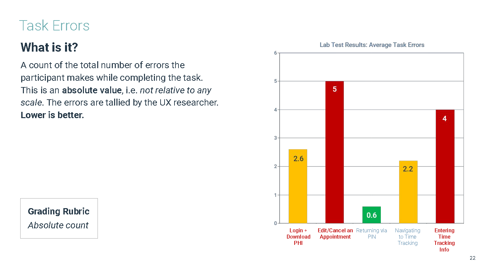
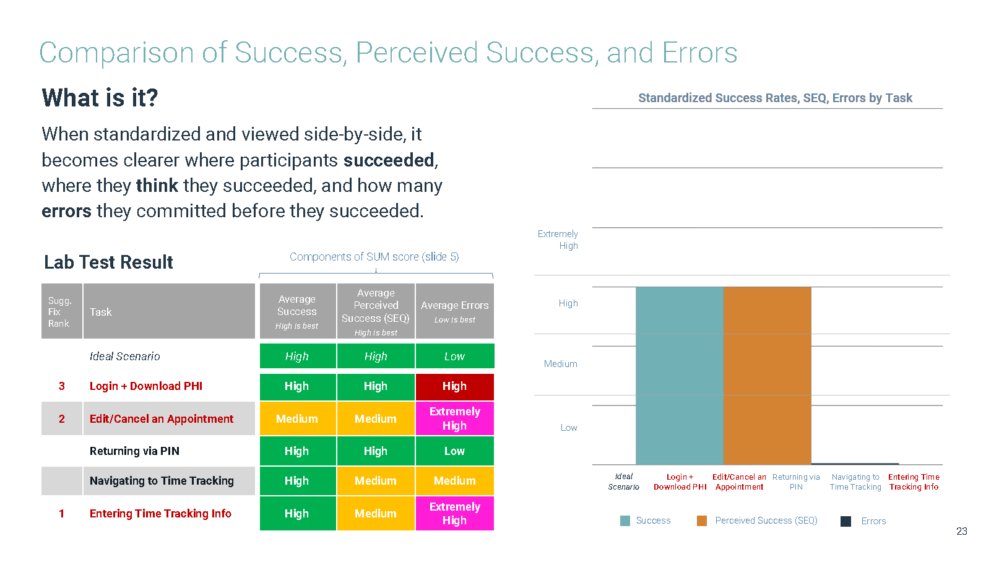
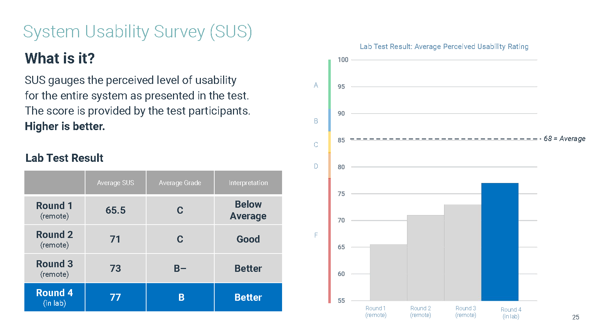
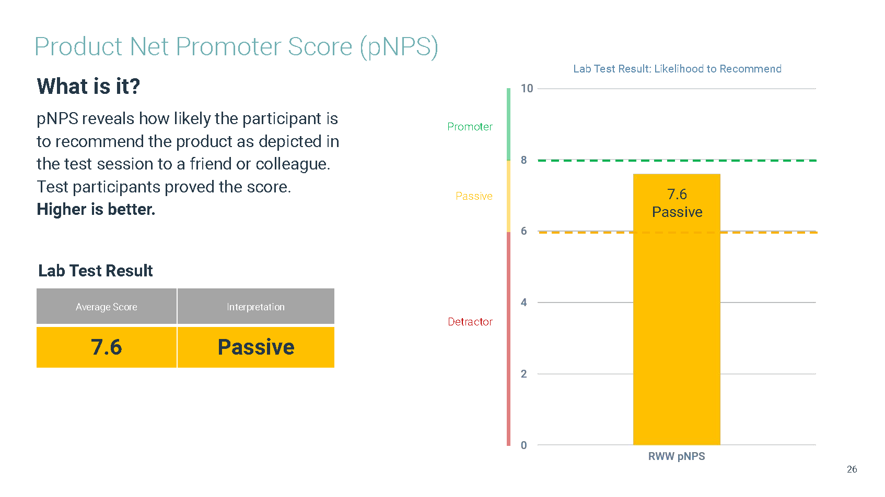

Under construction. For now, pealse see [WellSky Project](https://timoprice.notion.site/Testing-a-mobile-nursing-app-s-usability-da703d91c8e84e489480b37494d7e073) on Notion.

<!--
# Synopsis

Usability testing SaaS software differs greatly from e-commerce sites. It doesn't involve optimizing content or button placement.

Usability testing medical software is another beast altogether. I liken it to usability testing Excel—there are a million and one jobs a user can do and even more workflows. And the users are also myriad.

Part of the UX research team's mandate is to guide the product and engineering teams on how to become more lean.

This means making smaller bets—2–4 week build-test-learn cycles instead of 6–12 month bets. Cutting down such a massive product into testable chunks required constant cooperation with product and engineering teammates to find the most valuable pieces to tackle testing and innovating first. This project involved testing one of these chunks.

The mobile UI we tested was a 

- coded prototype of a mobile application
- for on-the-road hospice nurses who are often in remote areas
- and thus have unreliable internet connections.

The app thus needed to have both online and offline functions.

## Goal

Identifiy workflows that participants were able to navigate successfully and those that they weren't.

## Method

In-lab, semi-structured workflow usability test. NB: This was the inaugural study in the company's UX lab that my manager and I designed and had built.

## Tasks

The team wanted to test the participants' ability of participants to 

- log in
- navigate between areas
- view their daily schedule
- view patient records
- create & edit their appointments
- update the patient health record
- track time and mileage

# Conclusion

## Business Impact

Moving the product from an aged desktop application to a mobile app both keeps a key client and opens up the market for other multi-million dollar deals.

**Increase customer revenue**
The mobile application reduces the time nurses spend in the patient's driveway writing up medical notes and typing these up after-hours at home. This frees them up to schedule an additional patient every day. This increases the overall revenue of the client health agency's business, as well as giving the nurses their evenings back.

**Decrease operational costs**
The mobile app automatically tracks the nurses' travel time and distance, reporting it back to an automated system that connects to the health agency's billing system. This decreases the need for back-office staff to enter the data manually.

**Increase revenue from new business**
The mobile platform enables WellSky to extend into the total addressable home healthcare market (TAM), which is worth ~$5B.

**Increase revenue from existing business**
The mobile platform enabled the company to upsell to our current client. The deal based in part on this study was worth ~$5M. 

**Improved brand equity**
Involving the client in the design process through lab usability testing both impressed them and enhanced their commitment to maintain a relationship with us.

## Details

This was the first usability test (remote or live) that developers were involved with. It went over extremely well and created a landslide of excitement and desire amongst other teams. 

This was in great part due to the fact that the insights gleaned from their involvement allowed them to increase their velocity and deliver **2-months of work in 2 weeks**.

Identifying usability issues early in the development lifecycle ensured that the product was the *right thing* to build.

This also saved on potential rework and the costs associated with it.

Finally, since the product and dev team had spent nearly six months going back and forth on what would be useful and usable to the client, the fact that this test fast-tracked the rest of the project into 2 weeks meant both saved costs and served as an example of what UX principles and processes can do for the rest of the company's product initiatives.

Task errors

Success metrics

Usability metrics

Satisfaction metrics

[Full report](https://drive.google.com/file/d/186dzmp_MfC5IAkqYacJigjxm0HBLxoO3/preview)

